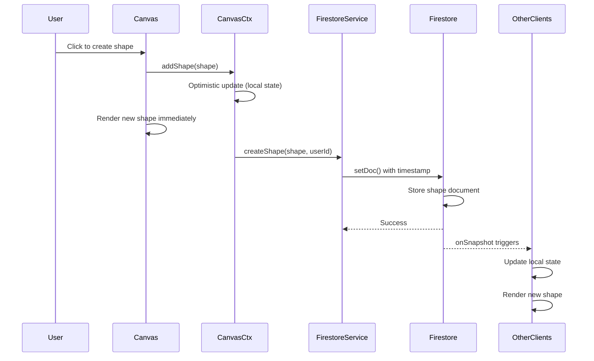
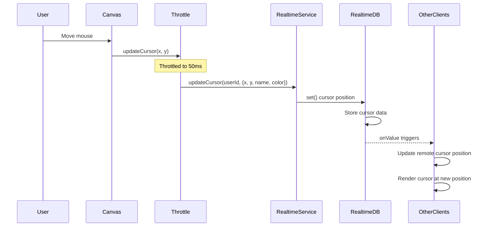
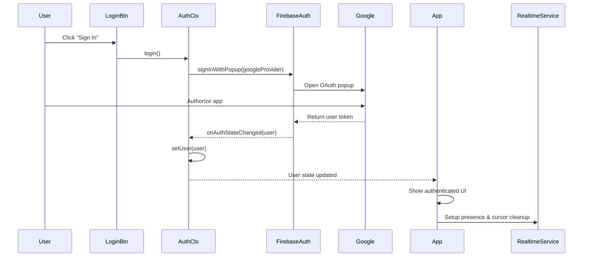
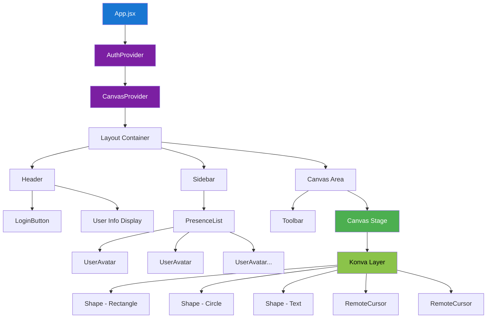
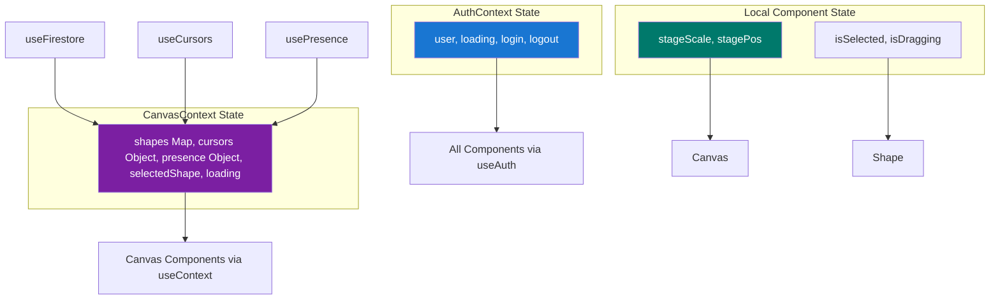
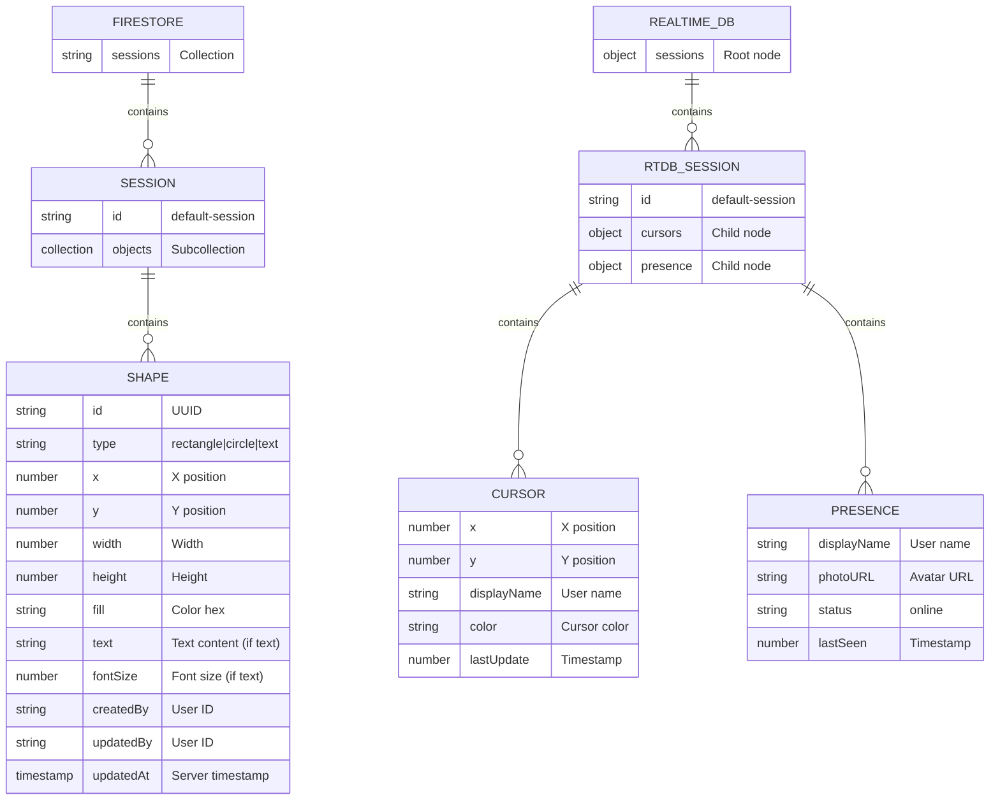
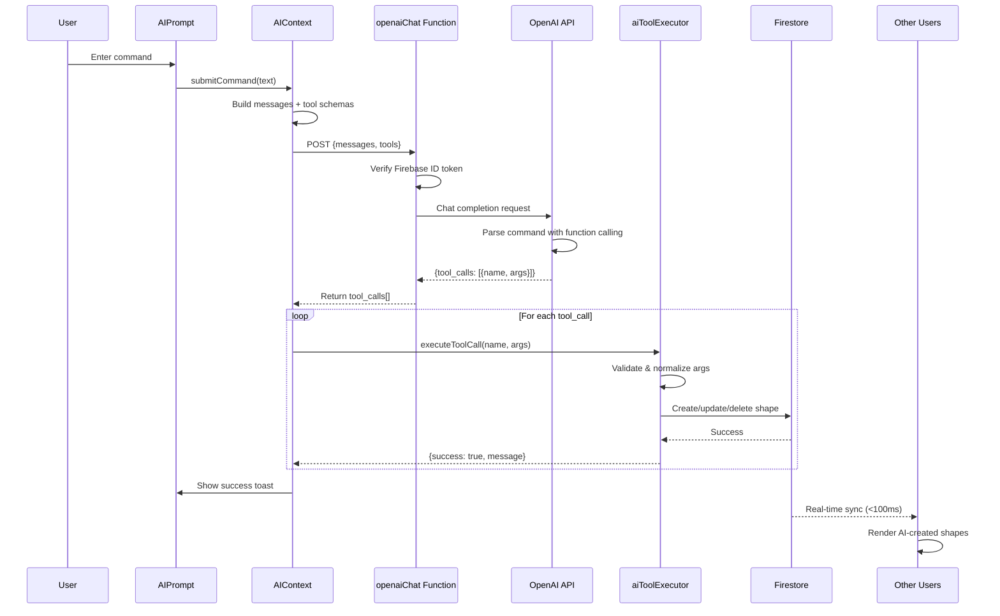
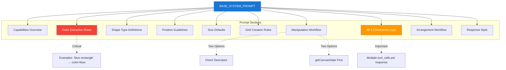

# CollabCanvas Architecture Diagram

## System Overview

```mermaid
graph TB
    subgraph "Testing Infrastructure"
        Jest[Jest Test Runner]
        RTL[React Testing Library]
        MockFirebase[Firebase Mocks]
        
        Jest --> RTL
        Jest --> MockFirebase
    end

    subgraph "Client Browser A"
        subgraph "React Application"
            App[App.jsx]
            
            subgraph "Context Providers"
                AuthCtx[AuthContext]
                CanvasCtx[CanvasContext]
            end
            
            subgraph "Components"
                LoginBtn[LoginButton]
                Canvas[Canvas Component]
                Toolbar[Toolbar]
                Shape[Shape Component]
                RemoteCursor[RemoteCursor]
                PresenceList[PresenceList]
                Header[Header]
            end
            
            subgraph "Custom Hooks"
                useAuth[useAuth]
                useFirestore[useFirestore]
                useCursors[useCursors]
            end
            
            subgraph "Services"
                FirebaseInit[firebase.js]
                FirestoreService[firestoreService.js]
                RealtimeService[realtimeDBService.js]
            end
            
            subgraph "Utilities"
                Throttle[throttle.js]
                Colors[colors.js]
                Shapes[shapes.js]
            end
        end
    end

    subgraph "Client Browser B"
        App2[React App Instance 2]
        Canvas2[Canvas + Components]
        Services2[Services Layer]
    end

    subgraph "Firebase Backend"
        subgraph "Firebase Auth"
            GoogleAuth[Google OAuth]
            AuthState[Auth State Management]
        end
        
        subgraph "Firestore Database"
            Sessions[/sessions/]
            Objects[/sessions/SESSION_ID/objects/]
            ShapeDoc[(Shape Documents)]
            
            Sessions --> Objects
            Objects --> ShapeDoc
        end
        
        subgraph "Realtime Database"
            RTDBSessions[/sessions/]
            Cursors[/sessions/SESSION_ID/cursors/]
            Presence[/sessions/SESSION_ID/presence/]
            
            RTDBSessions --> Cursors
            RTDBSessions --> Presence
        end
    end

    %% Client A Connections
    App --> AuthCtx
    App --> CanvasCtx
    AuthCtx --> useAuth
    CanvasCtx --> useFirestore
    CanvasCtx --> useCursors
    
    LoginBtn --> useAuth
    Canvas --> CanvasCtx
    Canvas --> Shape
    Canvas --> RemoteCursor
    Toolbar --> CanvasCtx
    Header --> PresenceList
    
    useAuth --> FirebaseInit
    useFirestore --> FirestoreService
    useCursors --> RealtimeService
    
    FirestoreService --> FirebaseInit
    RealtimeService --> FirebaseInit
    
    Shape --> Shapes
    Canvas --> Throttle
    Shape --> Colors

    %% Firebase Connections - Client A
    FirebaseInit -.->|Authentication| GoogleAuth
    FirestoreService -.->|Read/Write Shapes| ShapeDoc
    FirestoreService -.->|onSnapshot Listener| ShapeDoc
    RealtimeService -.->|Cursor Updates 50ms| Cursors
    RealtimeService -.->|Presence Updates| Presence
    RealtimeService -.->|onValue Listeners| Cursors
    RealtimeService -.->|onValue Listeners| Presence

    %% Firebase Connections - Client B
    App2 -.->|Same as Client A| GoogleAuth
    Canvas2 -.->|Real-time Sync| ShapeDoc
    Services2 -.->|Cursor Updates| Cursors
    Services2 -.->|Presence Updates| Presence

    %% Real-time Sync Between Clients
    ShapeDoc -.->|Broadcast Changes| Canvas2
    ShapeDoc -.->|Broadcast Changes| Canvas
    Cursors -.->|Stream Positions| RemoteCursor
    Presence -.->|Stream Online Users| PresenceList

    %% Testing Connections
    Jest -.->|Tests| useAuth
    Jest -.->|Tests| useFirestore
    Jest -.->|Tests| FirestoreService
    Jest -.->|Tests| Throttle
    Jest -.->|Tests| Colors
    Jest -.->|Tests| Shapes
    RTL -.->|Tests| LoginBtn
    RTL -.->|Tests| Canvas
    RTL -.->|Tests| Shape
    MockFirebase -.->|Mocks| FirebaseInit

    style "Testing Infrastructure" fill:#f0f0f0,stroke:#666,stroke-width:2px
    style "Client Browser A" fill:#e3f2fd,stroke:#1976d2,stroke-width:3px
    style "Client Browser B" fill:#e3f2fd,stroke:#1976d2,stroke-width:3px
    style "Firebase Backend" fill:#fff3e0,stroke:#f57c00,stroke-width:3px
    style ShapeDoc fill:#4caf50,stroke:#2e7d32,color:#fff
    style Cursors fill:#ff9800,stroke:#e65100,color:#fff
    style Presence fill:#ff9800,stroke:#e65100,color:#fff
```

## Data Flow Diagrams

### Shape Creation Flow



### Cursor Movement Flow



### Authentication Flow



## Component Hierarchy



## Testing Architecture

```mermaid
graph LR
    subgraph "Unit Tests"
        UT1[colors.test.js]
        UT2[shapes.test.js]
        UT3[throttle.test.js]
        UT4[firestoreService.test.js]
        UT5[AuthContext.test.jsx]
    end
    
    subgraph "Integration Tests"
        IT1[useFirestore.integration.test.js]
        IT2[Shape.integration.test.jsx]
        IT3[LoginButton.test.jsx]
        IT4[Canvas.test.jsx]
    end
    
    subgraph "Manual E2E Tests"
        E2E1[Multi-browser sync test]
        E2E2[Cursor movement test]
        E2E3[Disconnect/reconnect test]
        E2E4[Race condition test]
    end
    
    subgraph "Test Utilities"
        Mocks[Firebase Mocks]
        Fixtures[Test Fixtures]
        Helpers[Test Helpers]
    end
    
    UT1 --> Helpers
    UT2 --> Helpers
    UT3 --> Helpers
    UT4 --> Mocks
    UT5 --> Mocks
    
    IT1 --> Mocks
    IT1 --> Fixtures
    IT2 --> Helpers
    IT3 --> Mocks
    IT4 --> Helpers
    
    E2E1 -.->|Requires| RealFirebase[Real Firebase Instance]
    E2E2 -.->|Requires| RealFirebase
    E2E3 -.->|Requires| RealFirebase
    E2E4 -.->|Requires| RealFirebase
    
    style "Unit Tests" fill:#4caf50,stroke:#2e7d32,stroke-width:2px
    style "Integration Tests" fill:#ff9800,stroke:#e65100,stroke-width:2px
    style "Manual E2E Tests" fill:#f44336,stroke:#c62828,stroke-width:2px
    style "Test Utilities" fill:#9c27b0,stroke:#6a1b9a,stroke-width:2px
```

## State Management Flow



## Database Schema



## Performance Considerations

```mermaid
graph LR
    subgraph "Optimization Strategies"
        Throttle[Throttle cursor updates<br/>50ms interval]
        OptimisticUI[Optimistic UI updates<br/>Local-first rendering]
        Debounce[Debounce shape updates<br/>Reduce writes]
        Memoization[React.memo for shapes<br/>Prevent re-renders]
        LazyLoad[Lazy load components<br/>Code splitting]
    end
    
    subgraph "Performance Targets"
        FPS[60 FPS canvas rendering]
        CursorLatency[<50ms cursor latency]
        ShapeLatency[<100ms shape sync]
        InitialLoad[<2s initial load]
    end
    
    Throttle -.-> CursorLatency
    OptimisticUI -.-> FPS
    OptimisticUI -.-> ShapeLatency
    Debounce -.-> ShapeLatency
    Memoization -.-> FPS
    LazyLoad -.-> InitialLoad
    
    style "Optimization Strategies" fill:#4caf50,stroke:#2e7d32
    style "Performance Targets" fill:#2196f3,stroke:#1565c0
```

## AI Canvas Agent Architecture (Planned - PRs 13-17)

### AI System Overview

```mermaid
graph TB
    subgraph "Client Browser"
        User[User Input]
        AIPrompt[AIPrompt Component]
        AIContext[AIContext Provider]
        Executor[aiToolExecutor]
        CanvasCtx2[CanvasContext]
        
        User --> AIPrompt
        AIPrompt --> AIContext
        AIContext --> OpenAIService[openaiService.js]
        AIContext --> Executor
        Executor --> CanvasCtx2
    end
    
    subgraph "Firebase Cloud Function"
        CloudFunc[openaiChat Function]
        Auth[ID Token Verification]
        RateLimit[Rate Limiter]
        
        CloudFunc --> Auth
        CloudFunc --> RateLimit
    end
    
    subgraph "OpenAI API"
        ChatAPI[Chat Completions API]
        FunctionCalling[Function Calling]
        
        ChatAPI --> FunctionCalling
    end
    
    subgraph "Firebase Backend"
        Firestore2[(Firestore)]
        RTDB2[(Realtime DB)]
    end
    
    OpenAIService -.->|HTTP POST| CloudFunc
    CloudFunc -.->|SDK Call| ChatAPI
    ChatAPI -.->|tool_calls[]| CloudFunc
    CloudFunc -.->|Response| OpenAIService
    
    Executor -.->|Create/Update/Delete| Firestore2
    CanvasCtx2 -.->|Sync Changes| Firestore2
    Firestore2 -.->|Real-time Sync| OtherUsers[Other Users]
    
    style "Client Browser" fill:#e3f2fd,stroke:#1976d2,stroke-width:3px
    style "Firebase Cloud Function" fill:#fff3e0,stroke:#f57c00,stroke-width:3px
    style "OpenAI API" fill:#f3e5f5,stroke:#7b1fa2,stroke-width:3px
    style "Firebase Backend" fill:#fff3e0,stroke:#f57c00,stroke-width:3px
    style ChatAPI fill:#9c27b0,color:#fff
    style Firestore2 fill:#4caf50,stroke:#2e7d32,color:#fff
```

### AI Command Flow



### AI Tool Execution Architecture

```mermaid
graph LR
    subgraph "OpenAI Response"
        ToolCall[tool_calls array]
    end
    
    subgraph "Tool Executor"
        Router[Tool Router]
        CreateShape[executeCreateShape]
        MoveShape[executeMoveShape]
        UpdateColor[executeUpdateShapeColor]
        DeleteShape[executeDeleteShape]
        RotateShape[executeRotateShape]
        CreateGrid[executeCreateGrid]
        Arrange[executeArrange*]
        GetState[executeGetCanvasState]
        
        Router --> CreateShape
        Router --> MoveShape
        Router --> UpdateColor
        Router --> DeleteShape
        Router --> RotateShape
        Router --> CreateGrid
        Router --> Arrange
        Router --> GetState
    end
    
    subgraph "Utilities"
        ColorNorm[colorNormalizer]
        ShapeID[shapeIdentification]
        GridGen[gridGenerator]
        ArrangeAlgo[arrangementAlgorithms]
        
        CreateShape --> ColorNorm
        MoveShape --> ShapeID
        UpdateColor --> ColorNorm
        UpdateColor --> ShapeID
        DeleteShape --> ShapeID
        CreateGrid --> ColorNorm
        CreateGrid --> GridGen
        Arrange --> ArrangeAlgo
    end
    
    subgraph "Canvas Actions"
        AddShape[addShape]
        UpdateShape[updateShape]
        DeleteShapeAction[deleteShape]
        BatchUpdate[batchUpdateShapes]
        
        CreateShape --> AddShape
        MoveShape --> UpdateShape
        UpdateColor --> UpdateShape
        DeleteShape --> DeleteShapeAction
        CreateGrid --> BatchUpdate
        Arrange --> BatchUpdate
    end
    
    subgraph "Firestore"
        ShapesCollection[(shapes collection)]
        
        AddShape -.-> ShapesCollection
        UpdateShape -.-> ShapesCollection
        DeleteShapeAction -.-> ShapesCollection
        BatchUpdate -.-> ShapesCollection
    end
    
    ToolCall --> Router
    
    style "OpenAI Response" fill:#f3e5f5,stroke:#7b1fa2
    style "Tool Executor" fill:#e1f5fe,stroke:#0277bd
    style "Utilities" fill:#fff9c4,stroke:#f57f17
    style "Canvas Actions" fill:#e8f5e9,stroke:#2e7d32
    style "Firestore" fill:#fff3e0,stroke:#f57c00
```

### AI Tool Schema Structure

```mermaid
graph TD
    subgraph "Tool Definitions (aiTools.js)"
        Tools[10 Tool Schemas]
        
        Create[createShape]
        GetState[getCanvasState]
        Move[moveShape]
        Color[updateShapeColor]
        Delete[deleteShape]
        Rotate[rotateShape]
        Grid[createGrid]
        ArrangeH[arrangeHorizontally]
        ArrangeV[arrangeVertically]
        Distribute[distributeEvenly]
        
        Tools --> Create
        Tools --> GetState
        Tools --> Move
        Tools --> Color
        Tools --> Delete
        Tools --> Rotate
        Tools --> Grid
        Tools --> ArrangeH
        Tools --> ArrangeV
        Tools --> Distribute
    end
    
    subgraph "Schema Components"
        Name[name: string]
        Desc[description: string]
        Params[parameters: object]
        Required[required: array]
        
        Create --> Name
        Create --> Desc
        Create --> Params
        Create --> Required
    end
    
    subgraph "OpenAI Function Calling"
        Parser[GPT-4 Parser]
        Validator[Schema Validator]
        
        Tools -.-> Parser
        Parser --> Validator
    end
    
    style "Tool Definitions (aiTools.js)" fill:#e3f2fd,stroke:#1976d2
    style "Schema Components" fill:#f3e5f5,stroke:#7b1fa2
    style "OpenAI Function Calling" fill:#fff3e0,stroke:#f57c00
```

### System Prompt Structure



---

## Legend

- **Solid lines** (→): Direct function calls or component relationships
- **Dashed lines** (-.->): Network calls or async operations
- **Blue boxes**: Client-side components
- **Orange boxes**: Firebase backend services
- **Green boxes**: Critical data stores
- **Grey boxes**: Testing infrastructure
- **Purple boxes**: AI/ML services

